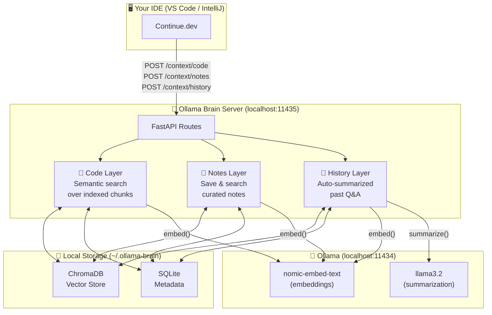

<div align="center">

# 🧠 Ollama Brain

### Persistent memory for your local AI models

Give your Ollama-powered coding assistant a **real, lasting understanding** of your codebase — across every session, across every IDE.

<br/>

[](https://python.org)
[](https://fastapi.tiangolo.com)
[](https://trychroma.com)
[](https://ollama.ai)
[](LICENSE)
[](tests/)

<br/>

**Works with** &nbsp;


via [Continue.dev](https://continue.dev)

</div>

---

## 😤 The Problem

Every time you close your chat with an Ollama model, it **forgets everything**.

```
You:  "How does authentication work in this project?"
AI:   "I don't have context about your project. Could you share the relevant files?"

You:  "We discussed this yesterday — JWT tokens, stored in .env"
AI:   "I apologize, I don't have memory of previous conversations..."
```

The AI hallucinates file names, contradicts past answers, and can't follow your architecture. You waste time re-explaining the same things over and over.

---

## ✅ The Solution

**Ollama Brain** runs a tiny local server that:

1. **Indexes your entire codebase** into a searchable vector database
2. **Remembers notes** you write about architecture, decisions, and gotchas
3. **Summarizes your past Q&A** so context carries forward automatically

Every query you make through Continue.dev **automatically pulls the most relevant context** from all three layers and injects it into the prompt — without you doing anything extra.

```
You:  "@code @notes How does authentication work?"

AI:   "Based on the code in auth/jwt_handler.py (lines 12–45) and your
       note 'Auth uses JWT, secrets in .env', here's how it works..."
```

---

## 🏗️ Architecture



---

## ⚡ Quick Start

### Prerequisites

Before you begin, make sure you have:

- [ ] **Python 3.11+** — `python --version`
- [ ] **Ollama running** — `ollama serve`
- [ ] **Required models pulled:**
  ```bash
  ollama pull nomic-embed-text
  ollama pull llama3.2
  ```
- [ ] **Continue.dev** installed in your IDE

---

## 📦 Installation

### Option A — Windows (One Click)

Clone the repo and double-click **`start.bat`**. It creates the venv, installs dependencies, and starts the server automatically.

```
git clone https://github.com/HimanshuGolani/Ollama-Memory.git
cd Ollama-Memory
start.bat
```

### Option B — Manual (All Platforms)

```bash
git clone https://github.com/HimanshuGolani/Ollama-Memory.git
cd Ollama-Memory

# Create virtual environment
python -m venv .venv

# Activate it
.venv\Scripts\activate        # Windows
source .venv/bin/activate      # macOS / Linux

# Install dependencies
pip install -r requirements.txt

# Start the server
python cli.py serve
```

> ✅ You should see: `INFO: Uvicorn running on http://0.0.0.0:11435`

---

## 🚀 Setup Guide (5 Steps)

### Step 1 — Start the server

```bash
python cli.py serve
```

Keep this terminal open while you work.

---

### Step 2 — Index your project

```bash
python cli.py index "C:/path/to/your/project"
```

```
Indexing C:/path/to/your/project...
Done. Indexed 847 chunks.
```

> 💡 Large projects take 1–2 minutes on first run. After that, files are re-indexed automatically whenever you save them.

---

### Step 3 — Get your Continue.dev config snippet

```bash
python cli.py configure "C:/path/to/your/project"
```

This prints a ready-to-paste JSON block:

<details>
<summary>📋 Click to see example output</summary>

```json
{
  "contextProviders": [
    {
      "name": "http",
      "params": {
        "url": "http://localhost:11435/context/code?project=C:/path/to/your/project",
        "title": "Code Memory",
        "description": "Relevant code chunks from the indexed codebase",
        "displayTitle": "code"
      }
    },
    {
      "name": "http",
      "params": {
        "url": "http://localhost:11435/context/notes?project=C:/path/to/your/project",
        "title": "Project Notes",
        "description": "Curated architecture notes and decisions",
        "displayTitle": "notes"
      }
    },
    {
      "name": "http",
      "params": {
        "url": "http://localhost:11435/context/history?project=C:/path/to/your/project",
        "title": "Conversation History",
        "description": "Relevant past Q&A about this project",
        "displayTitle": "history"
      }
    }
  ],
  "slashCommands": [
    {
      "name": "remember",
      "description": "Save a note about this codebase",
      "step": "HttpSlashCommand",
      "params": {
        "url": "http://localhost:11435/remember"
      }
    }
  ]
}
```

</details>

---

### Step 4 — Paste into Continue.dev config

Open `~/.continue/config.json` and merge the output into it.

| IDE | How to open config |
|---|---|
| **VS Code** | `Ctrl+Shift+P` → `Continue: Open config.json` |
| **IntelliJ IDEA** | Continue sidebar → ⚙️ gear icon → `Open config.json` |

Merge the `contextProviders` and `slashCommands` arrays into the existing file, then save.

---

### Step 5 — Use it in chat

In Continue's chat input, type `@` to see your memory layers:

| Provider | What it searches |
|---|---|
| `@code` | Indexed source files — finds relevant functions and classes |
| `@notes` | Your saved notes — architecture decisions, gotchas, facts |
| `@history` | Summarized past Q&A — what you've already discussed |

**Example:**
```
@code @notes How does the payment flow work?
```

Continue fetches the most semantically relevant content from all three layers and injects it into the prompt automatically.

---

## 📝 Saving Notes

Tell Ollama Brain things it should always remember:

**From the terminal:**
```bash
python cli.py remember "Auth uses JWT. Secrets stored in .env. Never hardcode tokens." \
  --project "C:/path/to/your/project"
```

**From Continue.dev chat (using the slash command):**
```
/remember The database is Postgres 15, running on port 5432. ORM is SQLAlchemy.
```

Notes are stored permanently and retrieved by semantic similarity on every query.

---

## 🖥️ CLI Reference

```
python cli.py --help
```

| Command | Example | Description |
|---|---|---|
| `serve` | `python cli.py serve` | Start the memory server |
| `index` | `python cli.py index C:/my/project` | Index a project's source files |
| `remember` | `python cli.py remember "note" --project C:/my/project` | Save a note |
| `status` | `python cli.py status` | List all indexed projects |
| `configure` | `python cli.py configure C:/my/project` | Print Continue.dev config snippet |

---

## ⚙️ Configuration

All settings have sensible defaults. Override with a `.env` file in the project root or shell environment variables:

| Variable | Default | Description |
|---|---|---|
| `OLLAMA_URL` | `http://localhost:11434` | Ollama server URL |
| `OLLAMA_BRAIN_PORT` | `11435` | Port for Ollama Brain |
| `OLLAMA_BRAIN_DATA_DIR` | `~/.ollama-brain` | Storage location |
| `OLLAMA_BRAIN_EMBED_MODEL` | `nomic-embed-text` | Embedding model |
| `OLLAMA_BRAIN_CHAT_MODEL` | `llama3.2` | Summarization model |

<details>
<summary>📄 Example .env file</summary>

```env
OLLAMA_URL=http://localhost:11434
OLLAMA_BRAIN_PORT=11435
OLLAMA_BRAIN_DATA_DIR=C:/Users/YourName/.ollama-brain
OLLAMA_BRAIN_EMBED_MODEL=nomic-embed-text
OLLAMA_BRAIN_CHAT_MODEL=llama3.2
```

</details>

---

## 📁 Supported File Types

<details>
<summary>View all 22 supported extensions</summary>

| Category | Extensions |
|---|---|
| Python | `.py` |
| JavaScript / TypeScript | `.js` `.ts` `.jsx` `.tsx` |
| JVM | `.java` `.kt` |
| Systems | `.go` `.rs` `.c` `.cpp` `.h` `.cs` `.swift` |
| Scripting | `.rb` `.php` |
| Config / Docs | `.md` `.txt` `.yaml` `.yml` `.json` `.toml` |

**Automatically skipped directories:**
`node_modules` · `__pycache__` · `.git` · `.venv` · `venv` · `dist` · `build` · `.idea` · `.vscode` · `target` · `bin` · `obj`

</details>

---

## 🔄 Auto Re-Index (File Watcher)

Once a project is indexed, Ollama Brain watches for file saves and **automatically re-indexes changed files within 2 seconds**. No need to re-run `index` after each edit.

```
[File saved: src/auth/jwt_handler.py]
  → Detected change
  → Re-indexing 3 chunks...
  → Done ✓
```

---

## 🗂️ Project Structure

```
Ollama-Memory/
├── 📄 cli.py              — CLI entry point (serve, index, remember, status, configure)
├── 📄 main.py             — FastAPI application + lifespan
├── 📄 config.py           — Settings via env vars
├── 📄 db.py               — SQLite layer (projects, notes, history)
├── 📄 embedder.py         — Ollama embedding wrapper
├── 📄 chroma_client.py    — ChromaDB client wrapper
├── 📄 indexer.py          — Language-aware file chunker + project indexer
├── 📄 watcher.py          — File system watcher (auto re-index on save)
├── 📁 layers/
│   ├── 📄 code.py         — Semantic code search
│   ├── 📄 notes.py        — Save + search notes
│   └── 📄 history.py      — Record queries + search summaries
├── 📁 routes/
│   ├── 📄 context.py      — POST /context/code|notes|history
│   ├── 📄 index_routes.py — POST|DELETE /index
│   ├── 📄 remember.py     — POST /remember
│   └── 📄 status.py       — GET /status
├── 📁 tests/              — 28 automated tests
├── 📄 requirements.txt
└── 📄 start.bat           — Windows one-click startup
```

---

## 🐛 Troubleshooting

<details>
<summary>❌ Server fails to start — "unable to open database file"</summary>

The data directory couldn't be created. Check that `~/.ollama-brain` (or your custom `OLLAMA_BRAIN_DATA_DIR`) is writable:

```bash
mkdir -p ~/.ollama-brain
```

</details>

<details>
<summary>🐢 Indexing is very slow</summary>

Make sure `nomic-embed-text` is pulled and loaded:

```bash
ollama pull nomic-embed-text
# Test it:
ollama run nomic-embed-text "hello"
```

The first embedding call loads the model into memory — subsequent calls are fast.

</details>

<details>
<summary>❓ @code / @notes / @history don't appear in Continue.dev</summary>

1. Confirm the server is running: open `http://localhost:11435/status` in a browser — you should see `{"status":"ok",...}`
2. Check the project path in `config.json` exactly matches the path you passed to `cli.py index` (no trailing slash)
3. Restart VS Code / IntelliJ after editing `config.json`

</details>

<details>
<summary>💬 History summarization isn't happening</summary>

Summaries are generated every **10 queries** using `llama3.2`. If the model isn't pulled, the batch is silently skipped (queries are still recorded):

```bash
ollama pull llama3.2
```

</details>

---

## 🤝 How the Memory Layers Work Together

```
Your question: "How does auth work?"
        │
        ├─► @code    searches vector index → returns jwt_handler.py:12-45
        │
        ├─► @notes   searches saved notes  → returns "Auth uses JWT, .env has secrets"
        │
        └─► @history searches past summaries → returns "Previously discussed: JWT flow, token refresh"
                                                         │
                                              All injected into prompt
                                                         │
                                              AI gives accurate, context-aware answer ✓
```

---

## 📜 License

MIT — free to use, modify, and distribute.

---

<div align="center">

Made to keep your AI assistant from forgetting everything between sessions.

**⭐ Star this repo if it saves you time!**

</div>
